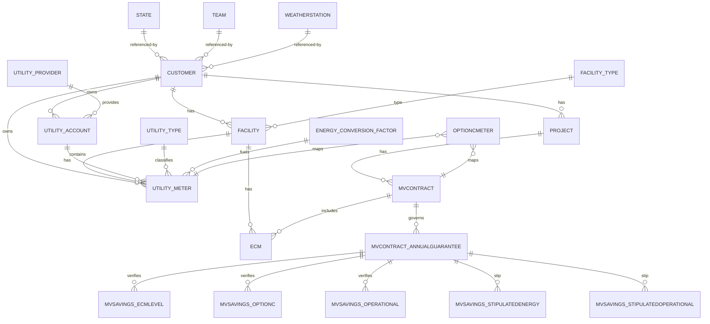
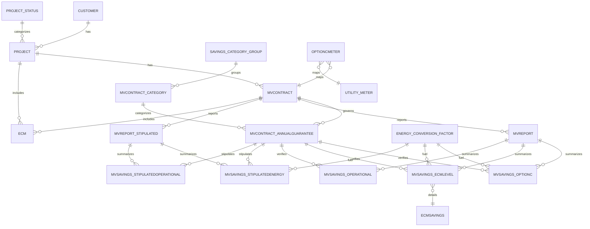
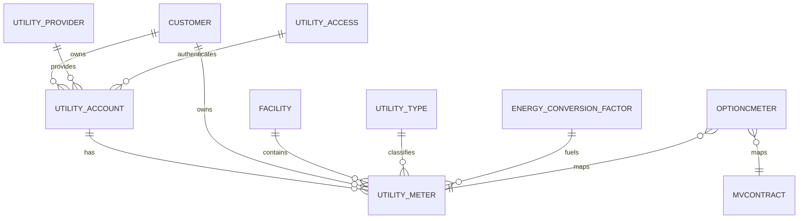
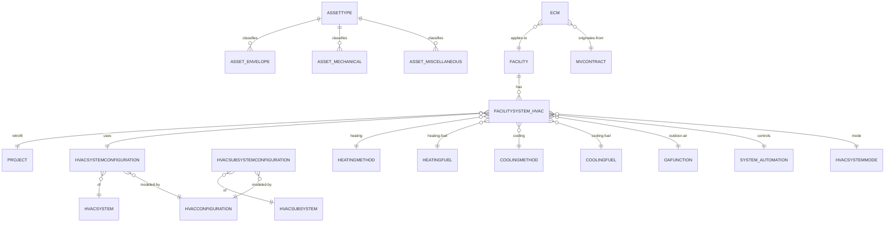

# Database Overview

## Summary
- Schemas: dbo (primary), dev (sandbox/test)
- Tables: 83 total (from ListofTables.md)
- Foreign keys: 77 (from ForeignKeys.md)
- Tables with primary keys: 81/83 (from Indexes.md)
- Tables without primary keys: dbo.EmployeeHistory, dev.emp

## Domain Map
- Customer/Org: Customer, CustomerType, State, Team, WeatherStation, WeatherStation_TMY
- Facility/HVAC: Facility, FacilityType, FacilitySystem_HVAC, HVACSystemConfiguration, HVACSystem, HVACConfiguration, HVACSubSystem, HVACSubSystemConfiguration, HeatingMethod, HeatingFuel, CoolingMethod, CoolingFuel, OAFunction, System_Automation, HVACSystemMode, HVACType
- Projects & M&V: Project, ProjectStatus, ProjectRFPRFQ, RFPRFQStatus, ProjectFeasibility, ProjectSelectedIGA, MVContract, MVContract_AnnualGuarantee, MVContract_Category, SavingsCategoryGroup, MVReport, MVReport_Stipulated, MVSavings_* (OptionC, ECMLevel, Operational, StipulatedEnergy, StipulatedOperational), ECM, ECMSavings
- Utilities & Meters: UtilityProvider, UtilityAccess, UtilityAccount, UtilityType, EnergyConversionFactor, UtilityMeter, OptionCMeter
- Weather Data: WeatherData_TMY, WeatherData_AMY, WeatherDataDailyNormals_2006-2020
- Assets & Systems: AssetType, Asset_Envelope, Asset_Mechanical, Asset_Miscellaneous; System_* (Lighting, DHW, Exhaust, KitchenExhaust, KitchenVentilation, BuildingVentilation)

## Core Entities
### Customer
  - PK: CustomerID
  - Outgoing FKs: StateID → State.stateID; CustomerTypeID → CustomerType.CustomerTypeID; TeamID → Team.ProjectTeamID; WeatherStationID → WeatherStation.WeatherStationID
  - Incoming refs: Project, Facility, UtilityAccount, UtilityMeter
### Facility
  - PK: FacilityID
  - Outgoing FKs: CustomerID → Customer; FacilityTypeID → FacilityType; StateID → State
  - Incoming refs: ECM, UtilityMeter, FacilitySystem_HVAC
### Project
  - PK: ProjectID
  - Outgoing FKs: CustomerID → Customer; ProjectStatusID → ProjectStatus
  - Incoming refs: MVContract, ProjectRFPRFQ, ProjectFeasibility, ProjectSelectedIGA, FacilitySystem_HVAC (RetrofitProjectID)
### MVContract
  - PK: MVContractID
  - Incoming refs: ECM, MVContract_AnnualGuarantee, MVContract_Category, MVReport, MVReport_Stipulated, MVSavings_OptionC, OptionCMeter
### ECM / ECMSavings
  - ECM: PK ECMID; FKs MVContractID → MVContract, FacilityID → Facility
  - ECMSavings: PK ECMSavingsID; FKs ECMID → ECM, FuelCodeID → EnergyConversionFactor
### UtilityMeter
  - PK: UtilityMeterID
  - Outgoing FKs: CustomerID → Customer; FacilityID → Facility; UtilityAccountID → UtilityAccount; UtilityTypeID → UtilityType; FuelCodeID → EnergyConversionFactor
  - Incoming refs: OptionCMeter, MVSavings_OptionC

## Column Dictionary (Key Entities)
### Customer
  - CustomerID (int, NOT NULL)
  - Customer_Name (varchar(100), NOT NULL)
  - Primary_Address (varchar(100), NULL)
  - City (varchar(50), NULL)
  - County (varchar(50), NULL)
  - Zip (varchar(5), NULL)
  - Federal_Tax_ID (varchar(15), NULL)
  - Federal_Tax_ID2 (varchar(15), NULL)
  - Logo_URL (varchar(500), NULL)
  - Latitude (decimal, NULL)
  - Longitude (decimal, NULL)
  - StateID (int, NOT NULL)
  - CustomerTypeID (int, NOT NULL)
  - WeatherStationID (int, NULL)
  - TeamID (int, NOT NULL)
### Facility
  - FacilityID (int, NOT NULL)
  - CustomerID (int, NOT NULL)
  - Facility_Name (varchar(100), NOT NULL)
  - Street_Address (varchar(100), NULL)
  - City (varchar(50), NULL)
  - StateID (int, NULL)
  - Zip (char(5), NULL)
  - Sq_Ft (int, NULL)
  - Year_Built (char(4), NULL)
  - Renovations (varchar(100), NULL)
  - Stories (decimal, NULL)
  - Occupied_Hours (varchar(200), NULL)
  - Occupancy (varchar(200), NULL)
  - FacilityTypeID (int, NULL)
### Project
  - ProjectID (int, NOT NULL)
  - CustomerID (int, NOT NULL)
  - Project_Name (varchar(50), NOT NULL)
  - Project_Name_Full (varchar(100), NULL)
  - ProjectStatusID (int, NOT NULL)
### MVContract
  - MVContractID (int, NOT NULL)
  - ProjectID (int, NOT NULL)
  - Contract_Sum (decimal, NOT NULL)
  - Contract_Execution_Date (date, NOT NULL)
  - Substantial_Completion_Date (date, NULL)
  - Guarantee_Years (smallint, NULL)
  - Included_MV_Years (smallint, NULL)
  - Additional_MV_Years (smallint, NULL)
  - MV_Cost_Workbook (decimal, NULL)
  - MV_Cost_Report (decimal, NULL)
  - MV_Cost_State_Report_Only (decimal, NULL)
  - MV_Cost_Subcontractor (decimal, NULL)
  - MV_Hours_Workbook (decimal, NULL)
  - MV_Hours_Report (decimal, NULL)
  - MV_Hours_State_Report_Only (decimal, NULL)
  - One_Time_Capital_Contribution (decimal, NULL)
  - Net_Turn_Key_Project_Total_Investment (decimal, NULL)
  - Project_Cost (decimal, NULL)
  - Project_Margin (decimal, NULL)
  - Bond_Cost (decimal, NULL)
  - Bond_Margin (decimal, NULL)
  - Builders_Risk_Insurance_Cost (decimal, NULL)
  - Builders_Risk_Insurance_Margin (decimal, NULL)
  - Included_MV_Cost (decimal, NULL)
  - Included_MV_Margin (decimal, NULL)
  - Finance_Term_Years (int, NULL)
  - Finance_Rate (decimal, NULL)
  - Year_0_Projected_Rebates (decimal, NULL)
  - MV_Workbook_Required (bit, NULL)
  - MV_Workbook_Delivered (bit, NULL)
  - MV_Workbook_Delivery_Date (date, NULL)
  - MV_Active (bit, NULL)
### ECM
  - ECMID (int, NOT NULL)
  - MVContractID (int, NOT NULL)
  - FacilityID (int, NULL)
  - ECM_Level (varchar(50), NULL)
  - ECM_Category (varchar(50), NULL)
  - ECM_Description (varchar(300), NULL)
  - ECM_Number (varchar(20), NULL)
  - Lighting_Trade_Cost (decimal, NULL)
  - Electrical_Trade_Cost (decimal, NULL)
  - Mechanical_Trade_Cost (decimal, NULL)
  - Controls_Automation_Trade_Cost (decimal, NULL)
  - Water_Trade_Cost (decimal, NULL)
  - Envelope_Trade_Cost (decimal, NULL)
  - IT_Trade_Cost (decimal, NULL)
  - Fleet_Trade_Cost (decimal, NULL)
  - Other_Trade1_Cost (decimal, NULL)
  - Other_Trade2_Cost (decimal, NULL)
  - Other_Trade3_Cost (decimal, NULL)
  - Project_Cost_NoMargin (decimal, NULL)
  - Guarantee_Fund_Cost (decimal, NULL)
  - Gen_Cond_PM_Cost (decimal, NULL)
  - Project_Contingency_Cost (decimal, NULL)
  - Commisioning_and_Training_Cost (decimal, NULL)
  - Rebate_Admin_Cost (decimal, NULL)
  - Energy_Eng_Cost (decimal, NULL)
  - Design_Eng_Cost (decimal, NULL)
  - Professional_Services_Cost (decimal, NULL)
  - Project_Admin_Cost (decimal, NULL)
  - Total_Project_Cost_with_Adders_No_Margin (decimal, NULL)
  - Margin_GP (decimal, NULL)
  - Project_Invesetment (decimal, NULL)
  - Percent_Total_Margin (decimal, NULL)
  - Utility_Savings_USD (decimal, NULL)
  - Gasoline_Savings_USD (decimal, NULL)
  - Operational_Savings_USD (decimal, NULL)
  - Capital_Avoidance_USD (decimal, NULL)
  - Rebates_USD (decimal, NULL)
  - Total_Savings_USD (decimal, NULL)
  - CO2_Reduction_Tons (decimal, NULL)
  - Cars_Removed (decimal, NULL)
  - Trees_Planted (decimal, NULL)
  - MVOption (varchar(50), NULL)
### ECMSavings
  - ECMSavingsID (int, NOT NULL)
  - ECMID (int, NOT NULL)
  - Utility (varchar(20), NULL)
  - FuelCodeID (char(1), NOT NULL)
  - On_Peak_Cost_Savings (decimal, NULL)
  - On_Peak_Unit_Savings (decimal, NULL)
  - Off_Peak_Cost_Savings (decimal, NULL)
  - Off_Peak_Unit_Savings (decimal, NULL)
  - Partial_Peak_Cost_Savings (decimal, NULL)
  - Partial_Peak_Unit_Savings (decimal, NULL)
  - Super_Peak_Cost_Savings (decimal, NULL)
  - Super_Peak_Unit_Savings (decimal, NULL)
  - On_Peak_Demand_Cost_Savings (decimal, NULL)
  - On_Peak_Demand_Savings (decimal, NULL)
  - Off_Peak_Demand_Cost_Savings (decimal, NULL)
  - Off_Peak_Demand_Unit_Savings (decimal, NULL)
  - Partial_Peak_Demand_Cost_Savings (decimal, NULL)
  - Partial_Peak_Demand_Unit_Savings (decimal, NULL)
  - Super_Off_Peak_Demand_Cost_Savings (decimal, NULL)
  - Super_Off_Peak_Demand_Unit_Savings (decimal, NULL)
  - On_Peak_Supply_Cost_Savings (decimal, NULL)
  - On_Peak_Supply_Unit_Savings (decimal, NULL)
  - Off_Peak_Supply_Cost_Savings (decimal, NULL)
  - Off_Peak_Supply_Unit_Savings (decimal, NULL)
  - Partial_Peak_Supply_Cost_Savings (decimal, NULL)
  - Partial_Peak_Supply_Unit_Savings (decimal, NULL)
  - Super_Off_Peak_Supply_Cost_Savings (decimal, NULL)
  - Super_Off_Peak_Supply_Unit_Savings (decimal, NULL)
  - On_Peak_PF_Cost_Savings (decimal, NULL)
  - On_Peak_PF_Unit_Savings (decimal, NULL)
  - Off_Peak_PF_Cost_Savings (decimal, NULL)
  - Off_Peak_PF_Unit_Savings (decimal, NULL)
  - Partial_Peak_PF_Cost_Savings (decimal, NULL)
  - Partial_Peak_PF_Unit_Savings (decimal, NULL)
  - Super_Off_Peak_PF_Cost_Savings (decimal, NULL)
  - Super_Off_Peak_PF_Unit_Savings (decimal, NULL)
### UtilityMeter
  - UtilityMeterID (int, NOT NULL)
  - UtilityAccountID (int, NOT NULL)
  - CustomerID (int, NOT NULL)
  - FacilityID (int, NOT NULL)
  - FuelCodeID (char(1), NOT NULL)
  - UtilityTypeID (int, NOT NULL)
  - Meter_Number (varchar(100), NOT NULL)
  - Service_Address (varchar(200), NULL)
  - Utility_Rate (varchar(200), NULL)
  - Cost_Calculation_Method (varchar(100), NULL)
  - Notes (varchar(500), NULL)

## ER Diagrams
### Core Overview


### Projects & M&V


### Utilities & Meters


### Assets & Systems


## Views
### dbo.v_MERA
  - Purpose: Consolidated meter/account registry per customer/facility with utility type, provider, conversion factor.
  - Key sources: Customer, Facility, UtilityMeter, UtilityAccount, UtilityType, UtilityProvider, EnergyConversionFactor.
  - Note: Uses TOP (100) PERCENT … ORDER BY (ordering not guaranteed in a view).
### dbo.v_ActiveMVMeters
  - Purpose: Active M&V meters joined to MERA and contract activity with access credentials.
  - Key sources: v_MERA, OptionCMeter, MVContract, UtilityAccount, UtilityAccess.
  - Note: Exposes UtilityAccess.Email/Username/Password.
### dbo.v_cdexUtilityAccounts
  - Purpose: Utility accounts with counts of meters by utility type (Electric/NatGas/Water) and total meters.
  - Key sources: UtilityAccount, UtilityMeter, UtilityProvider, Customer.
### dbo.v_LeopardoConversion
  - Purpose: Pipeline conversion summary for TeamID = 2 across feasibility, RFPRFQ, IGA, MVContract.
  - Key sources: Customer, Project, ProjectFeasibility, ProjectRFPRFQ, ProjectSelectedIGA, MVContract, RFPRFQStatus.
### dbo.v_MVContractMapping
  - Purpose: Map Customer ↔ Project ↔ MVContract identifiers and names.
  - Key sources: MVContract, Project, Customer.
### dbo.v_MVSavings_Verified
  - Purpose: Aggregated verified savings (Option C, ECMLevel, Operational) with contract/category context.
  - Key sources: MVSavings_OptionC, MVSavings_ECMLevel, MVSavings_Operational, MVContract_AnnualGuarantee, MVReport, MVContract_Category.
### dbo.v_MVSavingsSummary
  - Purpose: Unified view of verified and stipulated savings with period boundaries and MV category.
  - Key sources: MVSavings_OptionC, MVSavings_ECMLevel, MVSavings_Operational, MVSavings_StipulatedEnergy, MVSavings_StipulatedOperational, MVContract_AnnualGuarantee, MVContract_Category, MVReport, MVReport_Stipulated.
### dbo.v_MVSchedule
  - Purpose: Generated schedule of report years, periods, and target dates per MVContract.
  - Key sources: MVContract (with a recursive Numbers CTE), MVReport.
### dbo.v_MVVerfiedSavings
  - Purpose: Alternative verified savings union across option types.
  - Key sources: MVSavings_OptionC, MVSavings_OptionA, MVSavings_NonMeasured, MVSavings_Custom, MVContract_AnnualGuarantee.
  - Note: Name spelled “Verfied”; references tables not present in ListofTables.md (OptionA/NonMeasured/Custom).
### dbo.v_PowerAppCustomer
  - Purpose: Flattened customer details with type/state/team for app consumption.
  - Key sources: Customer, CustomerType, State, Team.
### dbo.v_PowerAppProjects
  - Purpose: Project details with status context, RFPRFQ/IGA/Feasibility indicators.
  - Key sources: Project, ProjectStatus, Customer, Team, ProjectFeasibility, ProjectRFPRFQ, RFPRFQStatus, ProjectSelectedIGA.
### dbo.v_Utilities
  - Purpose: Flattened utilities view combining meter, account, provider, conversion, and facility/customer.
  - Key sources: UtilityMeter, UtilityAccount, UtilityProvider, Facility, Customer, EnergyConversionFactor, UtilityType.
### sys.database_firewall_rules
  - Purpose: System view stub (Azure SQL) surfaced in metadata.

## Indexes (High Level)
- Primary keys defined for 81/83 tables; missing on dbo.EmployeeHistory and dev.emp.
- Composite primary key example: OptionCMeter (MVContractID, UtilityMeterID).
- Suggestion: ensure nonclustered indexes exist for all foreign key columns on child tables to support joins and deletes.

## Exploratory SQL (SQL Server)
- List views and definitions
```sql
SELECT v.schema_id,
       SCHEMA_NAME(v.schema_id) AS schema_name,
       v.name,
       m.definition
FROM sys.views v
JOIN sys.sql_modules m ON m.object_id = v.object_id
ORDER BY schema_name, v.name;
```
- Object dependencies
```sql
-- Objects referencing a specific table
SELECT OBJECT_SCHEMA_NAME(referencing_id) AS schema_name,
       OBJECT_NAME(referencing_id) AS referencing_object,
       referenced_entity_name
FROM sys.sql_expression_dependencies
WHERE referenced_id = OBJECT_ID('dbo.TableName');

-- Objects that a specific view/proc depends on
SELECT OBJECT_SCHEMA_NAME(referenced_id) AS schema_name,
       OBJECT_NAME(referenced_id) AS referenced_object,
       referenced_entity_name
FROM sys.sql_expression_dependencies
WHERE referencing_id = OBJECT_ID('dbo.ViewOrProcName');
```
- Table row counts (approximate)
```sql
SELECT s.name AS schema_name,
       t.name AS table_name,
       SUM(p.row_count) AS rows
FROM sys.dm_db_partition_stats p
JOIN sys.tables t ON t.object_id = p.object_id
JOIN sys.schemas s ON s.schema_id = t.schema_id
WHERE p.index_id IN (0,1)
GROUP BY s.name, t.name
ORDER BY rows DESC;
```
- Foreign keys (outgoing/incoming) for a table
  - Outgoing FKs from a table (parent → referenced): use sys.foreign_keys + sys.foreign_key_columns + sys.columns filtered on parent table.
  - Incoming FKs (children referencing a table): same join, filtered on referenced table.
- Indexes for a table
```sql
SELECT i.name,
       i.is_unique,
       i.is_primary_key,
       c.name AS column_name,
       ic.key_ordinal
FROM sys.indexes i
JOIN sys.index_columns ic
  ON ic.object_id = i.object_id
 AND ic.index_id  = i.index_id
JOIN sys.columns c
  ON c.object_id = i.object_id
 AND c.column_id = ic.column_id
WHERE i.object_id = OBJECT_ID('dbo.TableName')
ORDER BY i.is_primary_key DESC, i.name, ic.key_ordinal;
```
- Column details for a table
```sql
SELECT COLUMN_NAME,
       ORDINAL_POSITION,
       DATA_TYPE,
       CHARACTER_MAXIMUM_LENGTH,
       IS_NULLABLE
FROM INFORMATION_SCHEMA.COLUMNS
WHERE TABLE_SCHEMA = 'dbo'
  AND TABLE_NAME  = 'TableName'
ORDER BY ORDINAL_POSITION;
```
- Temporal/Versioned tables
```sql
SELECT s.name AS schema_name,
       t.name AS table_name,
       t.temporal_type,
       t.history_table_id
FROM sys.tables t
JOIN sys.schemas s ON s.schema_id = t.schema_id
WHERE t.temporal_type > 0;
```
- Routines (procs/functions)
```sql
SELECT s.name AS schema_name,
       o.name,
       o.type,
       o.type_desc
FROM sys.objects o
JOIN sys.schemas s ON s.schema_id = o.schema_id
WHERE o.type IN ('P','FN','IF','TF')
ORDER BY s.name, o.type, o.name;
```
- Triggers and synonyms
```sql
-- Triggers
SELECT s.name AS schema_name,
       t.name AS table_name,
       tr.name AS trigger_name
FROM sys.triggers tr
JOIN sys.tables t  ON t.object_id  = tr.parent_id
JOIN sys.schemas s ON s.schema_id  = t.schema_id
ORDER BY s.name, t.name;

-- Synonyms
SELECT SCHEMA_NAME(schema_id) AS schema_name,
       name,
       base_object_name
FROM sys.synonyms;
```

## Appendix
- Source files: ListofTables.md, TableColumns.md, ForeignKeys.md, Indexes.md, views.md
- Counts computed from these files at time of generation.
