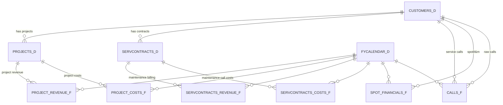

# POWER BI MODELING GUIDE — CRR v02 Unified Revenue Model (Updated)
Version 4.1

---

## 0. Table of Contents
1. Overview  
2. Data Model ERDs  
3. Fact Tables  
4. Dimension Tables  
5. Revenue Stream Definitions  
6. Gross Profit (GP) Modeling  
7. DAX Measures Library (Current)  
8. Executive View Requirements  
9. Planned / Deferred Items (Retention, Renewal, Segmentation, Ratios)  

---

## 1. Overview
This model unifies three revenue streams:
- **Projects** – project revenue and service projects modeled as projects.
- **Service Contracts** – recurring maintenance billed revenue and maintenance call costs.
- **Spot / T&M** – ad-hoc calls with no contract number.

Key goals:
- Total revenue, cost, GP, and GP% across all streams.
- Prevent double counting between service projects and maintenance contracts.
- Surface data-quality gaps (contract orphans).

Primary Snowflake sources:
- `DW_FINAL.JOB_MONTHLY_SUMMARY_F` (jobs staging for revenue/cost)
- `DW_FINAL.CONTRACT_BILLING_F` (contract billing)
- `DW_FINAL.CALLS_F` (service calls)
- `DW_FINAL.JOBS_D` (jobs dimension)
- `DW_FINAL.CONTRACTS_D` (contracts dimension)
- `DW_FINAL.CUSTOMERS_D` (customers)
- Calendar surfaced as `FYCALENDAR_D`

---

## 2. Data Model ERDs

### 2.1 High-Level ERD — Revenue Ecosystem


---

## 3. Fact Tables

### 3.1 PROJECT_REVENUE_F
- **Sources:** Job earned revenue from `JOB_FINANCIALS_F` (derived from `JOB_MONTHLY_SUMMARY_F`); service project billing from `CONTRACT_BILLABLE_F`.
- **Grain:** SurrogateProjectID × Date.
- **Anti-fan-out:** Service projects deduped on `Project Number` before joining billing.
- **Columns:** Date, SurrogateProjectID, Customer Number/Key, Amount, Source Type (`Job Earned`, `Service Billing`).

### 3.2 PROJECT_COSTS_F
- **Sources:** Job monthly cost from `JOB_FINANCIALS_F`; service project call costs from `CALLS_F`.
- **Grain:** SurrogateProjectID × Date.
- **Anti-fan-out:** Service projects deduped on `Project Number` before joining calls; keeps `Service Call Id` for tracing.
- **Columns:** Date, SurrogateProjectID, Amount, Source Type (`Job Cost`, `Service Call Cost`), Service Call Id.

### 3.3 SERVCONTRACTS_REVENUE_F
- **Source:** `CONTRACT_BILLABLE_F`.
- **Filters:** Excludes contract numbers that are service projects; keeps non-null `Customer_Contract_Year Key` as `AgreementKey`.
- **Columns:** Date, AgreementKey, Amount, Source Type (`Service Contract Billing`).

### 3.4 SERVCONTRACTS_COSTS_F
- **Source:** `CALLS_F`.
- **Filters:** Excludes service projects; drops blank contract numbers.
- **Columns:** Date, AgreementKey, Amount, Source Type (`Contract Call Cost`).

### 3.5 SPOT_FINANCIALS_F
- **Source:** `CALLS_F` where contract number is blank/null (spot/T&M).
- **Columns:** Date, Customer Number/Key, Revenue, Cost.

### 3.6 CALLS_F (raw/staging)
- Used for diagnostics and as the base for spot and service project cost logic.

---

## 4. Dimension Tables

### 4.1 PROJECTS_D
- **Built from:** `SERVPROJECTS_D` (SERVICE PROJECT slice of `CONTRACTS_D`) + `JOBSTRIMMED_D` (slimmed `JOBS_D`).
- **Adds:** `Project Type` (`Service Contract` vs `Job`), `SurrogateProjectID` (`SERV_<Customer Number>_<Project Number>` or `JOB_<Customer Key>_<Project Key>`).
- **Cleans:** Removes known bad surrogate `SERV_CN991413_11/21REPEX`.

### 4.2 SERVCONTRACTS_D_STAGING
- **Built from:** `CONTRACTS_D`.
- **Logic:** Excludes service projects, explodes contract years via `Wscontsq`, builds `AgreementKey = Custnmbr+Source "_" Contract Number "_" YearIndex`, groups master/servant, reapplies types.

### 4.3 SERVCONTRACTS_D
- **Built from:** Staging + inferred/orphan rows.
- **Logic:** Collects AgreementKeys from revenue and cost facts; labels orphans (`Revenue Only`, `Cost Only`, `Both`), parses AgreementKey to create placeholder dimension rows so every fact has a dimension match.

### 4.4 CUSTOMERS_D
- Standard customer dimension from Snowflake.

### 4.5 FYCALENDAR_D and Time Intelligence
- Shared calendar and helper table for all facts.

---

## 5. Revenue Stream Definitions

### 5.1 Projects
- **Fact:** `PROJECT_REVENUE_F` (job earned + service project billing).
- **Keys:** SurrogateProjectID (from PROJECTS_D).
- **Dedup:** Service projects deduped on Project Number before joining billing to prevent double billing.

### 5.2 Service Contracts
- **Revenue fact:** `SERVCONTRACTS_REVENUE_F` (billing) excluding service projects.
- **Cost fact:** `SERVCONTRACTS_COSTS_F` (maintenance call costs) excluding service projects.
- **Keys:** AgreementKey (Customer+Source+Contract+YearIndex).
- **Orphans:** SERVCONTRACTS_D surfaces orphan contract-years for data-quality remediation.

### 5.3 Spot / T&M
- **Fact:** `SPOT_FINANCIALS_F` (calls with no contract number).
- **Fields:** Revenue, Cost.

### 5.4 Totals
- Total revenue/cost/GP across Projects + Service Contracts + Spot via explicit total measures.

---

## 6. Gross Profit (GP) Modeling
- **Project GP** = Project Revenue – Project Cost.  
- **Service Contract GP** = Service Contract Revenue – Service Contract Cost.  
- **Spot GP** = Spot Revenue – Spot Cost.  
- **Total GP** = Project GP + Service Contract GP + Spot GP.  
- **Total GP %** = Total GP ÷ Total Revenue.  

---

## 7. DAX Measures Library (Current)
Measures in `_Key Measures` (plus `Spot Cost` in `CALLS_F`).

### 7.1 Revenue
```DAX
Project Revenue = SUM(PROJECT_REVENUE_F[Amount])
Service Contract Revenue = SUM(SERVCONTRACTS_REVENUE_F[Amount])
Spot Revenue = SUM(SPOT_FINANCIALS_F[Revenue])
Total Revenue = [Project Revenue] + [Service Contract Revenue] + [Spot Revenue]

Check_Source_Revenue_Total =
VAR JobRevenue = SUM('JOB_MONTHLY_SUMMARY_F'[Contract Earned Curr Mo])
VAR ContractBillingRevenue = SUM('CONTRACT_BILLABLE_F'[BILLABLE_ALL])
VAR SpotCallsRevenue =
    CALCULATE(SUM('CALLS_F'[Billable All]), 'CALLS_F'[Contract Number] = BLANK() || 'CALLS_F'[Contract Number] = "")
RETURN
    JobRevenue + ContractBillingRevenue + SpotCallsRevenue

Check_Dest_Revenue_Total =
VAR ProjectRev = SUM('PROJECT_REVENUE_F'[Amount])
VAR ContractRev = SUM('SERVCONTRACTS_REVENUE_F'[Amount])
VAR SpotRev = SUM('SPOT_FINANCIALS_F'[Revenue])
RETURN
    ProjectRev + ContractRev + SpotRev

Check_Revenue_Variance = [Check_Source_Revenue_Total] - [Check_Dest_Revenue_Total]
```

### 7.2 Cost
```DAX
Project Cost = SUM(PROJECT_COSTS_F[Amount])
Service Contract Cost = SUM(SERVCONTRACTS_COSTS_F[Amount])
Spot Cost = SUM(SPOT_FINANCIALS_F[Cost])   -- defined in CALLS_F
Total Cost = [Project Cost] + [Service Contract Cost] + [Spot Cost]

Check_Source_Calls = SUM('CALLS_F'[Cost All])
Check_Dest_Total =
      CALCULATE(SUM('PROJECT_COSTS_F'[Amount]), 'PROJECT_COSTS_F'[Source Type] = "Service Call Cost")
    + SUM('SERVCONTRACTS_COSTS_F'[Amount])
    + SUM('SPOT_FINANCIALS_F'[Cost])
Check_Variance = [Check_Source_Calls] - [Check_Dest_Total]
```

### 7.3 Gross Profit
```DAX
Project GP = [Project Revenue] - [Project Cost]
Project GP % = DIVIDE([Project GP], [Project Revenue])
Project GP % (Formatted) = FORMAT([Project GP %], "0.0%")

Service Contract Gross Profit = [Service Contract Revenue] - [Service Contract Cost]
Service Contract Gross Profit % = DIVIDE([Service Contract Gross Profit], [Service Contract Revenue])

Spot Gross Profit = [Spot Revenue] - [Spot Cost]
Spot GP % = DIVIDE([Spot Gross Profit], [Spot Revenue])

Total Gross Profit = [Total Revenue] - [Total Cost]
Total GP % = DIVIDE([Total Gross Profit], [Total Revenue])
```

### 7.4 Additional Checks / Totals
```DAX
Total Contract Billings = SUM('CONTRACT_BILLABLE_F'[BILLABLE_ALL])
Total Contract Costs = SUM('CALLS_F'[Cost All])
Job Monthly Revenue = SUM(JOB_MONTHLY_SUMMARY_F[Contract Earned Curr Mo])
Job Monthly Cost = SUM(JOB_MONTHLY_SUMMARY_F[Monthly Cost])
Job Monthly GP = [Job Monthly Revenue] - [Job Monthly Cost]
Job Actual GP% = DIVIDE([Job Monthly GP], [Job Monthly Revenue])
```

---

## 8. Executive View Requirements
- Total Revenue, Cost, GP$, GP% by stream (Project, Service Contract, Spot) and combined.
- Visibility into orphaned maintenance contract keys for data-quality remediation.
- Top customers/divisions; project/service/spot breakdowns.
- Optional (future): retention (NRR/GRR), churn/upsell/contraction, renewal timelines once implemented.

---

## 9. Planned / Deferred Items (Retention, Renewal, Segmentation, Ratios)

### 9.1 Retention Modeling (planned)
- Universes: Contract NRR/GRR (maintenance only) and Customer NRR/GRR (all streams).
- Definitions: Churn (had revenue prior, none current), Upsell (increase for retained), Contraction (decrease for retained).
- Period logic: clarify fiscal/calendar and comparison window; retained sets via prior-period customers/contracts.

### 9.2 Renewal Modeling (planned)
- Infer start/end from billing per AgreementKey (MIN/MAX Date); optionally use source contract start/end if reliable.
- Status example: Active / Expiring (<90 days) / Expired based on inferred end; use for renewal timelines and churn views.

### 9.3 Segmentation Mapping (planned)
- Add normalization table to standardize agreement subtypes, project categories, spot vs maintenance for consistent slicing.

### 9.4 Planned Measures (ratios/retention)
```DAX
TM per Maint $ (planned) = DIVIDE([Spot Revenue], [Service Contract Revenue])
Project per Maint $ (planned) = DIVIDE([Project Revenue], [Service Contract Revenue])

Total Revenue Prior (planned) =
    CALCULATE([Total Revenue], DATEADD(FYCALENDAR_D[Date], -1, MONTH))

Prior Customers (planned) =
    CALCULATETABLE(VALUES(CUSTOMERS_D[Customer Key]), DATEADD(FYCALENDAR_D[Date], -1, MONTH))

Revenue Same Customers (planned) =
    CALCULATE([Total Revenue], KEEPFILTERS(Prior Customers))

Customer NRR (planned) = DIVIDE([Revenue Same Customers], [Total Revenue Prior])

Customer GRR (planned, maintenance only) =
    DIVIDE(
        CALCULATE([Service Contract Revenue], KEEPFILTERS(Prior Customers)),
        CALCULATE([Service Contract Revenue], DATEADD(FYCALENDAR_D[Date], -1, MONTH))
    )

Churn Customers (planned) =
    EXCEPT(
        CALCULATETABLE(VALUES(CUSTOMERS_D[Customer Key]), DATEADD(FYCALENDAR_D[Date], -1, MONTH)),
        CALCULATETABLE(VALUES(CUSTOMERS_D[Customer Key]))
    )

Revenue Churn (planned) = 1 - [Customer NRR]

Upsell (planned) =
VAR Curr = [Revenue Same Customers]
VAR Prior = [Total Revenue Prior]
RETURN MAX(Curr - Prior, 0)

Contraction (planned) =
VAR Curr = [Revenue Same Customers]
VAR Prior = [Total Revenue Prior]
RETURN MIN(Curr - Prior, 0)
```
